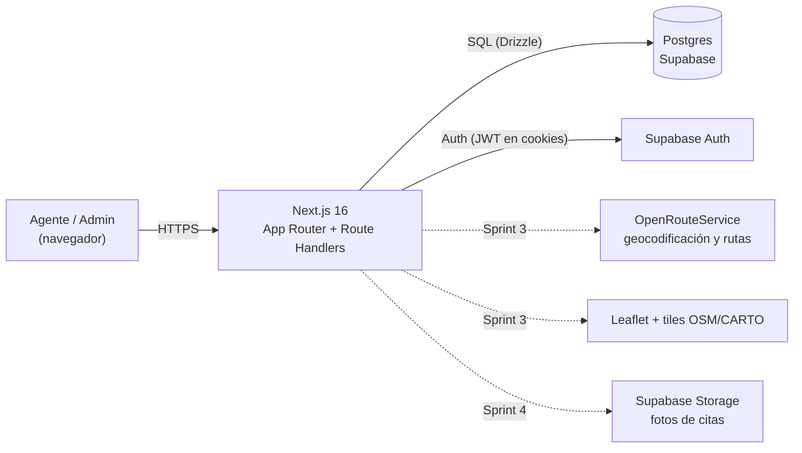
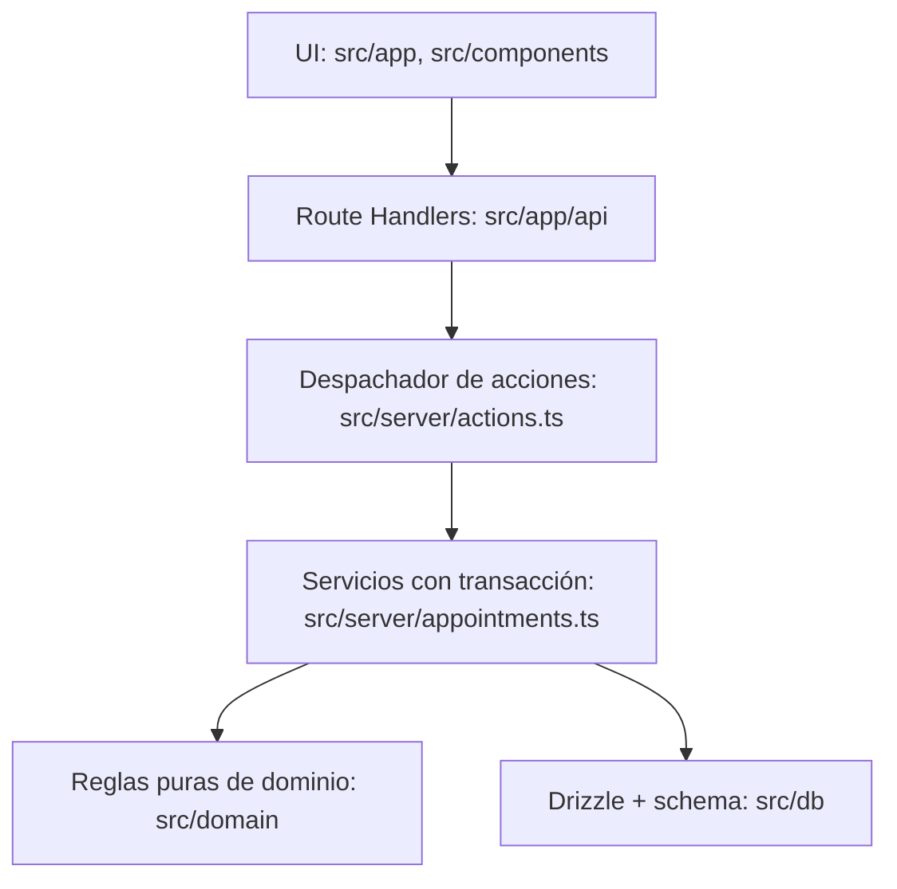
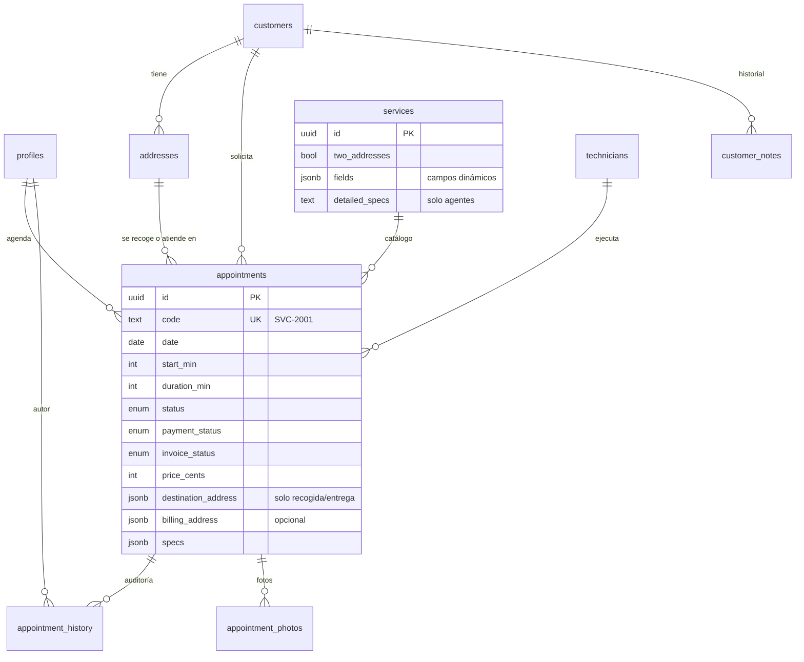
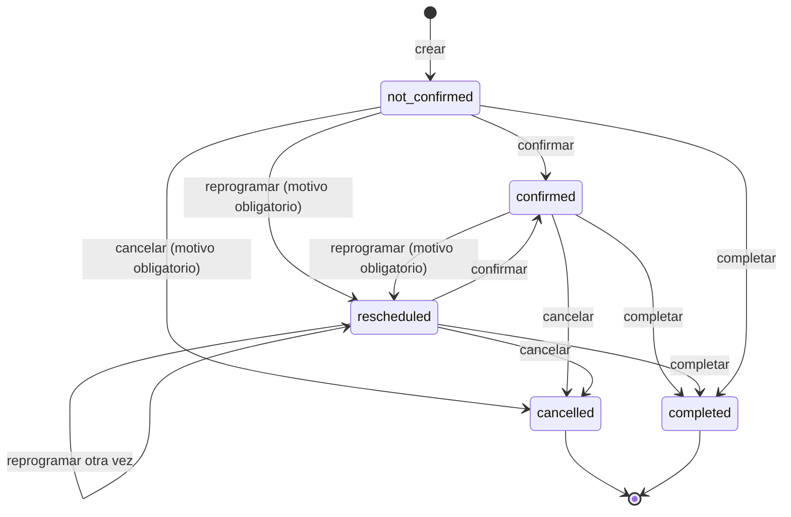
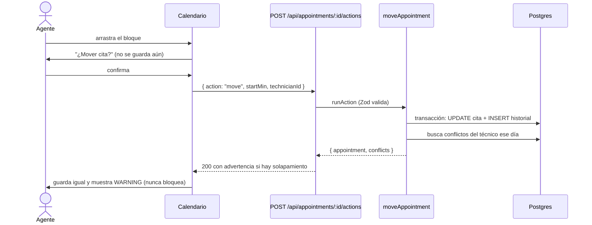

# Arquitectura

## Contexto del sistema

## Capas

La regla de dependencia apunta hacia abajo: `src/domain` no importa nada de Next ni de la base de datos, por eso se prueba sin infraestructura.

## Modelo de datos

Decisiones de modelado: `destination_address` y `billing_address` son instantáneas JSON dentro de la cita (una dirección puntual no ensucia el perfil del cliente); el dinero se guarda en centavos; el estado de la cita, el pago y la factura son tres columnas independientes.

## Estados de una cita

El pago (`unpaid` → `paid`) y la factura (`not_generated` → `generated` → `sent`) avanzan por separado y no dependen de este diagrama.

## Mover una cita con drag & drop

## Reglas de negocio implementadas

| Regla                                                         | Dónde vive                                 | Prueba                                   |
| ------------------------------------------------------------- | ------------------------------------------ | ---------------------------------------- |
| Una cita nueva empieza como no confirmada y no pagada         | `createAppointment`                        | `appointments.test.ts`                   |
| Cancelar conserva la cita y exige motivo (`other` pide texto) | `resolveCancelReason`, `cancelAppointment` | `domain.test.ts`, `appointments.test.ts` |
| Reprogramar exige motivo                                      | `rescheduleSchema`, `requireReason`        | `appointments.test.ts`                   |
| Solapamiento del mismo técnico es advertencia, nunca bloqueo  | `findConflicts`                            | `domain.test.ts`, `appointments.test.ts` |
| Toda acción relevante escribe quién, qué, desde y hacia       | `persist`                                  | `appointments.test.ts`                   |
| Recogida y entrega exigen dirección de entrega                | `createAppointment`                        | `appointments.test.ts`                   |
| Campos obligatorios por servicio                              | `createAppointment`                        | `appointments.test.ts`                   |
| Pago, factura y estado son independientes                     | columnas separadas                         | `appointments.test.ts`                   |
| La IA nunca mueve citas                                       | no existe ninguna ruta que lo haga solo    | revisión de diseño                       |
