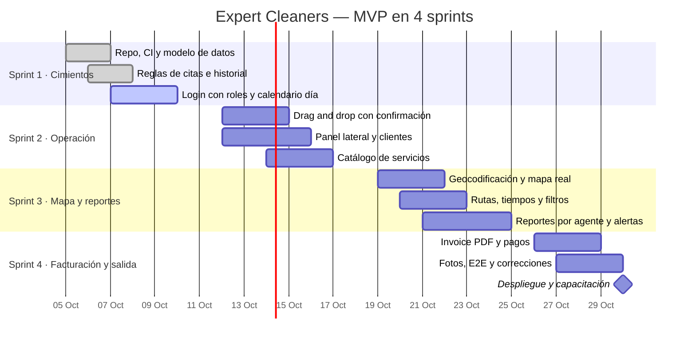

# Roadmap

Fechas propuestas para 4 sprints semanales; se ajustan a la aprobación del mockup por el staff.

## Riesgos

| Riesgo                                              | Probabilidad | Impacto | Mitigación                                              |
| --------------------------------------------------- | ------------ | ------- | ------------------------------------------------------- |
| Reglas "Por confirmar" sin resolver                 | Alta         | Media   | Regla genérica y marcada; se cambia en una fase 2       |
| Supabase gratuito pausa el proyecto por inactividad | Media        | Alta    | Avisar al cliente; plan Pro si entra en producción real |
| Límites de tiles y geocodificación gratuitos        | Baja         | Media   | Cachear coordenadas; proveedor intercambiable           |
| Plazo de 4 semanas ajustado                         | Media        | Alta    | Priorización MoSCoW; IA y pagos automáticos a fase 2    |
